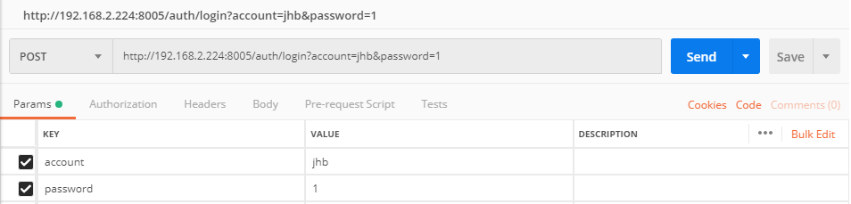
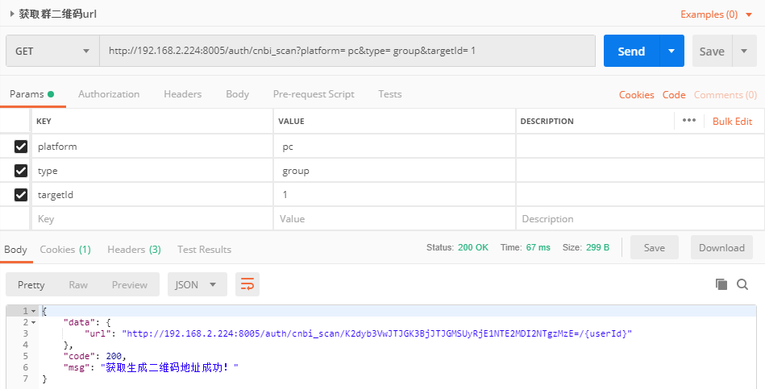
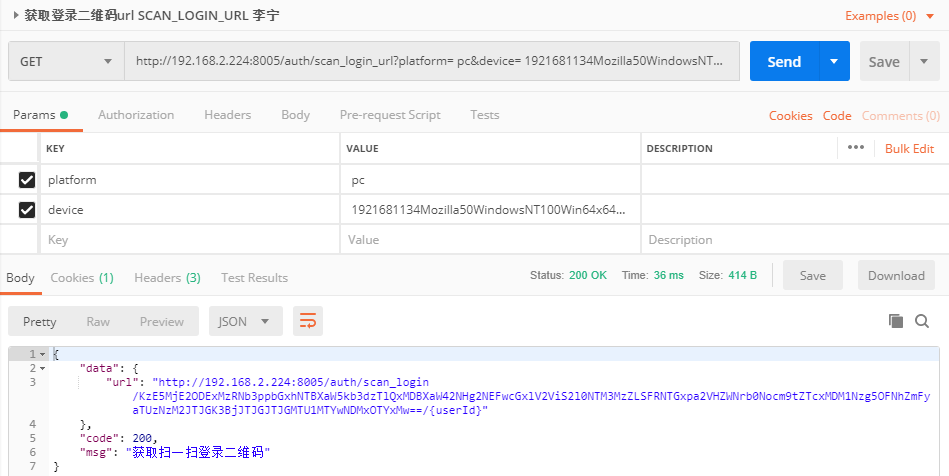
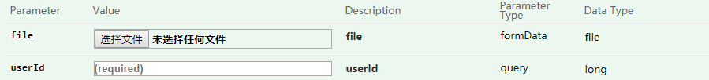
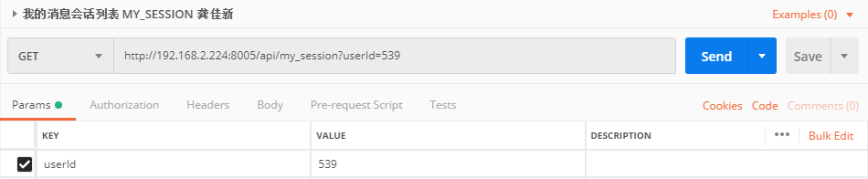
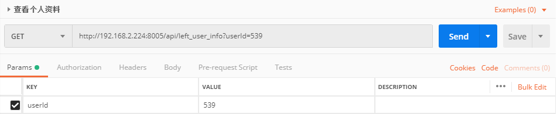
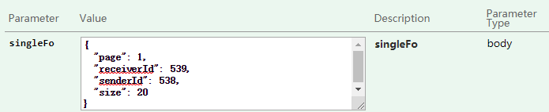
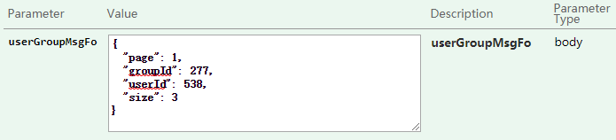

## 客户端登出 USER_LOGOUT

GET /auth/logout
登录登出二维码操作接口 : Login Client Rest  


```js
// 传参
params: { // 这里需要用 params 不可以用 data
  authorization: 'amhiJTdFNTM5JTQwMTcyMTcwMTRQb3N0bWFuUnVudGltZTc2MCU0MDc1MjglN0UxJTdFNjAwMDAw'
}
```

```js
// 返回数据
{
  "data": "amhiJTdFNTM5JTQwMTcyMTcwMTRQb3N0bWFuUnVudGltZTc2MCU0MDc1MjglN0UxJTdFNjAwMDAw,amhiJTdFNTM5JTQwMTcyMTcwMTRQb3N0bWFuUnVudGltZTc2MCU0MDc1MjglN0UxJTdFNjAwMDAw",
  "code": 200,
  "msg": "退出成功"
}
```

## 客户端帐号密码登录 USER_LOGIN

POST /auth/login
登录登出二维码操作接口 : Login Client Rest  


```js
// 传参
params: { // 这里需要用 params 不可以用 data
  account: '登录用户名',
  password: '密码'
}
```

```js
// 返回数据
{
    "data": {
        "user": {
            "id": 539,
            "birthday": null,
            "avatar": "http://192.168.2.214:8000/group2/M00/00/0D/wKgC2lxqYKWAZAzHAAS8TUHSEpA876.png",
            "email": "jhb@cnbisoft.com",
            "phone": "15951508388",
            "sign": null,
            "trueName": "姜海斌",
            "username": "jhb",
            "sex": 56,
            "workState": null,
            "enable": 1
        },
        "dept": {
            "id": 48,
            "note": "测试",
            "code": "3724",
            "pid": "1",
            "text": "雨测试部",
            "leaf": 0,
            "level": 1,
            "ownerId": 289,
            "companyId": 1,
            "ownerName": null,
            "userCount": null,
            "userContainChild": null,
            "childDeptCount": null
        },
        "role": {
            "id": 48,
            "text": "体验用户",
            "companyId": 53,
            "admin": 0,
            "note": "体验用户"
        },
        "company": {
            "id": 53,
            "text": "江苏农垦",
            "avatar": "http://jiaxin365.cn/images/jsnk.svg",
            "note": "农垦项目演示",
            "enable": 1,
            "licenseId": 7,
            "createUser": 397,
            "rangeId": 19,
            "industryId": 1446,
            "typeId": null,
            "regionId": 530101,
            "rangeText": null,
            "industryText": null,
            "regionText": null,
            "typeText": null,
            "customerId": "1",
            "url": "http://192.168.1.138:8082/",
            "code": "1010",
            "pid": "26",
            "leaf": 0,
            "primaryId": null,
            "level": 1,
            "authCompanyIds": null,
            "children": null
        },
        "license": {
            "id": 7,
            "text": "集团用户",
            "maxlevel": 5,
            "single": 20,
            "userCount": 20
        },
        "deviceVo": {
            "brand": "jhb",
            "device": "17217014PostmanRuntime760",
            "platform": "windows"
        },
        "authorization": "amhiJTdFNTM5JTQwMTcyMTcwMTRQb3N0bWFuUnVudGltZTc2MCU0MDc1MjglN0UxJTdFNjAwMDAw"
    },
    "code": 200,
    "msg": "登录成功"
}
```

## 获取(群)二维码的生成地址 SCAN_URL

GET /auth/cnbi_scan  
登录登出二维码操作接口 : Login Client Rest  


```js
// 传参
{
  platform: 'pc',         // 设备平台
  type: 'group',          // 类型：群组
  targetId: 1             // 群id
}
```

```js
// 返回
{
    "data": {
        "url": "http://192.168.2.224:8005/auth/cnbi_scan/K2dyb3VwJTJGK3BjJTJGMSUyRjE1NTE2MDI2NTgzMzE=/{userId}"
    },
    "code": 200,
    "msg": "获取生成二维码地址成功！"
}
```

## 获取登录二维码url SCAN_LOGIN_URL 李宁

GET /auth/scan_login_url  
登录登出二维码操作接口 : Login Client Rest


```js
{
  platform: 'pc',
  device: '1921681134Mozilla50WindowsNT100Win64x64AppleWebKit53736KHTMLlikeGeckoChrome710357898Safari53736' // socket链接成功后返回的设备号
}
```

```js
// 返回
{
    "data": {
        "url": "http://192.168.2.224:8005/auth/scan_login/KzE5MjE2ODExMzRNb3ppbGxhNTBXaW5kb3dzTlQxMDBXaW42NHg2NEFwcGxlV2ViS2l0NTM3MzZLSFRNTGxpa2VHZWNrb0Nocm9tZTcxMDM1Nzg5OFNhZmFyaTUzNzM2JTJGK3BjJTJGJTJGMTU1MTYwNDMxOTYxMw==/{userId}"
    },
    "code": 200,
    "msg": "获取扫一扫登录二维码"
}
```

## 文件上传 FILE_UPLOAD 李宁

POST /api/file_upload  
文件数据操作接口 : File Client Rest


```js
// res
{
  "data": {
    "id": 4018,
    "text": "QQ截图20190116145757.png",
    "hdUrl": "http://192.168.2.214:8000/group2/M00/00/0E/wKgC21x7m_SANj1eAAAb-goZO7U211.png",
    "type": null,
    "thumbUrl": "http://192.168.2.214:8000/group2/M00/00/0E/wKgC21x7m_SANj1eAAAb-goZO7U211.png",
    "size": 0,
    "playTime": 0,
    "category": "png"
  },
  "code": 200,
  "msg": "上传成功"
}
```

## 我的消息会话列表 MY_SESSION 龚佳新

GET /api/my_session  
首页我的数据操作接口 : Index Client Rest


```js
// params
{
  userId: '539' // 用户id
}
```

```js
// res
{
    "data": [
        {
            "senderId": null,
            "receiverId": null,
            "content": null,
            "sendTime": null,
            "state": 0,
            "type": null,
            "platform": null,
            "name": "新朋友",
            "avatar": "http://jiaxin365.cn/images/cloud/msg_icon/message_new%20friends.png",
            "otherAvatar": null,
            "otherName": null,
            "miniType": 11016,
            "count": 0,
            "id": null
        },
        {
            "senderId": null,
            "receiverId": null,
            "content": null,
            "sendTime": null,
            "state": 0,
            "type": null,
            "platform": null,
            "name": "群助手",
            "avatar": "http://jiaxin365.cn/images/cloud/msg_icon/message_group.png",
            "otherAvatar": null,
            "otherName": null,
            "miniType": 11017,
            "count": 0,
            "id": null
        },
        {
            "senderId": null,
            "receiverId": 1,
            "content": null,
            "sendTime": null,
            "state": 0,
            "type": null,
            "platform": null,
            "name": "分析助手",
            "avatar": "http://jiaxin365.cn/images/cloud/card_icon/home_app_data.png",
            "otherAvatar": null,
            "otherName": null,
            "miniType": 11021,
            "count": 0,
            "id": null
        },
        {
            "senderId": 244,
            "receiverId": 224,
            "content": "组织",
            "sendTime": 1550891724787,
            "state": 2,
            "type": 1,
            "platform": null,
            "name": "刘琪",
            "avatar": "http://jiaxin365.cn/images/cloud/msg_icon/mes_list_mrtx.png",
            "otherAvatar": "http://192.168.2.214:8000/group2/M00/00/03/wKgC2lvREyuATUKIAAAKz2bbv6k985.png",
            "otherName": "龚春关键是体验会u。斤斤计较和",
            "miniType": 1101,
            "count": 0,
            "id": "00000000691859a501691859ad8c0001"
        },
        {
            "senderId": 539,
            "receiverId": 253,
            "content": "sdfsdfd",
            "sendTime": 1550830692467,
            "state": 2,
            "type": 1,
            "platform": null,
            "name": "姜海斌",
            "avatar": "http://192.168.2.214:8000/group2/M00/00/0D/wKgC2lxqYKWAZAzHAAS8TUHSEpA876.png",
            "otherAvatar": "http://jiaxin365.cn/images/cloud/msg_icon/mes_list_group_mrtx.png",
            "otherName": "龚佳新2,马军,姜海斌",
            "miniType": 1101,
            "count": 0,
            "id": "cnbift15508306925941550830692594"
        },
        {
            "senderId": 539,
            "receiverId": 252,
            "content": "fghfgh",
            "sendTime": 1550829993956,
            "state": 2,
            "type": 1,
            "platform": null,
            "name": "姜海斌",
            "avatar": "http://192.168.2.214:8000/group2/M00/00/0D/wKgC2lxqYKWAZAzHAAS8TUHSEpA876.png",
            "otherAvatar": "http://jiaxin365.cn/images/cloud/msg_icon/mes_list_group_mrtx.png",
            "otherName": "卢诚,丁威,方涛涛",
            "miniType": 1101,
            "count": 0,
            "id": "cnbift15508299940751550829994075"
        },
        {
            "senderId": 397,
            "receiverId": 539,
            "content": "34534",
            "sendTime": 1551525485614,
            "state": 0,
            "type": 1,
            "platform": null,
            "name": "马军",
            "avatar": "http://192.168.2.214:8000/group2/M00/00/06/wKgC2lwbjzqAf8l9AA0wOp3BTZk491.jpg",
            "otherAvatar": null,
            "otherName": null,
            "miniType": 1100,
            "count": 4,
            "id": "cnbift15515254992641551525499264"
        },
        {
            "senderId": 538,
            "receiverId": 539,
            "content": "1234",
            "sendTime": 1551520763169,
            "state": 2,
            "type": 1,
            "platform": null,
            "name": "程雪怡",
            "avatar": "http://jiaxin365.cn/images/cloud/msg_icon/mes_list_mrtx.png",
            "otherAvatar": null,
            "otherName": null,
            "miniType": 1100,
            "count": 0,
            "id": "cnbift15515207631341551520763134"
        },
        {
            "senderId": 244,
            "receiverId": 539,
            "content": "d\ng",
            "sendTime": 1550135718781,
            "state": 2,
            "type": 1,
            "platform": null,
            "name": "刘琪",
            "avatar": "http://jiaxin365.cn/images/cloud/msg_icon/mes_list_mrtx.png",
            "otherAvatar": null,
            "otherName": null,
            "miniType": 1100,
            "count": 0,
            "id": "cnbift15501357171961550135717196"
        },
        {
            "senderId": 372,
            "receiverId": 539,
            "content": "66@@6@",
            "sendTime": 1550135717388,
            "state": 2,
            "type": 1,
            "platform": null,
            "name": "周鹏翔",
            "avatar": "http://192.168.2.214:8000/group2/M00/00/0C/wKgC21xkwVCAHxjHAAL_kAIRozc866.png",
            "otherAvatar": null,
            "otherName": null,
            "miniType": 1100,
            "count": 0,
            "id": "490921E6864F4795AF474136146640E0"
        },
    ],
    "code": 200,
    "msg": "查询成功"
}
```

## 查看个人资料，左边自己的详细信息

GET /api/left_user_info  
首页我的数据操作接口 : Index Client Rest


```js
// res
{
    "data": {
        "user": {
            "id": 539,
            "birthday": null,
            "avatar": "http://192.168.2.214:8000/group2/M00/00/0D/wKgC2lxqYKWAZAzHAAS8TUHSEpA876.png",
            "email": "jhb@cnbisoft.com",
            "phone": "15951508388",
            "sign": null,
            "trueName": "姜海斌",
            "username": "jhb",
            "sex": 56,
            "workState": null,
            "enable": 1
        },
        "work": null,
        "sex": {
            "id": 56,
            "text": "未知",
            "url": null,
            "type": null,
            "code": "803"
        },
        "dept": null,
        "company": {
            "id": 53,
            "text": "江苏农垦",
            "avatar": "http://jiaxin365.cn/images/jsnk.svg",
            "note": "农垦项目演示",
            "enable": 1,
            "licenseId": 7,
            "createUser": 397,
            "rangeId": 19,
            "industryId": 1446,
            "typeId": null,
            "regionId": 530101,
            "rangeText": "500-999人",
            "industryText": "水的生产和供应业",
            "regionText": "文山州广南县",
            "typeText": null,
            "customerId": "1",
            "url": "http://192.168.1.138:8082/",
            "code": "1010",
            "pid": "26",
            "leaf": 0,
            "primaryId": null,
            "level": 1,
            "authCompanyIds": null,
            "children": null
        },
        "role": {
            "id": 48,
            "text": "体验用户",
            "companyId": 53,
            "admin": 0,
            "note": "体验用户"
        },
        "license": null
    },
    "code": 200,
    "msg": "查询成功"
}
```

## 获取 单聊消息

POST /api/find_single_msg  
消息操作接口 : Message Client Rest


```js
// params
{
  "page": 1,
  "receiverId": 539,
  "senderId": 538,
  "size": 3
}
```

```js
{
  "data": {
    "totalElements": 230,
    "totalPages": 77,
    "data": [
      {
        "senderId": 538,
        "receiverId": 539,
        "content": "1234",
        "sendTime": 1551520763169,
        "state": 2,
        "type": 1,
        "platform": null,
        "name": "程雪怡",
        "avatar": "http://jiaxin365.cn/images/cloud/msg_icon/mes_list_mrtx.png",
        "id": "cnbift15515207631341551520763134"
      },
      {
        "senderId": 539,
        "receiverId": 538,
        "content": "ab",
        "sendTime": 1551520699053,
        "state": 2,
        "type": 1,
        "platform": null,
        "name": "姜海斌",
        "avatar": "http://192.168.2.214:8000/group2/M00/00/0D/wKgC2lxqYKWAZAzHAAS8TUHSEpA876.png",
        "id": "cnbift15515206990441551520699044"
      },
      {
        "senderId": 538,
        "receiverId": 539,
        "content": "12",
        "sendTime": 1551520654084,
        "state": 2,
        "type": 1,
        "platform": null,
        "name": "程雪怡",
        "avatar": "http://jiaxin365.cn/images/cloud/msg_icon/mes_list_mrtx.png",
        "id": "cnbift15515206540701551520654070"
      }
    ]
  },
  "code": 200,
  "msg": "操作成功！"
}
```

## 获取 群聊聊消息

-   POST /api/find_group_msg
-   消息操作接口 : Message Client Rest  



```js
// params
{
  "page": 1,
  "groupId": 277,
  "userId": 538,
  "size": 3
}
```

```js
{
  "data": {
    "totalElements": 25,
    "totalPages": 9,
    "data": [
      {
        "senderId": 539,
        "receiverId": 277,
        "content": "asd",
        "sendTime": 1550648056778,
        "state": 0,
        "type": 1,
        "platform": null,
        "name": "姜海斌",
        "avatar": "http://192.168.2.214:8000/group2/M00/00/0D/wKgC2lxqYKWAZAzHAAS8TUHSEpA876.png",
        "id": "cnbift15506480283871550648028387"
      },
      {
        "senderId": 539,
        "receiverId": 277,
        "content": "khjk",
        "sendTime": 1550647763437,
        "state": 0,
        "type": 1,
        "platform": null,
        "name": "姜海斌",
        "avatar": "http://192.168.2.214:8000/group2/M00/00/0D/wKgC2lxqYKWAZAzHAAS8TUHSEpA876.png",
        "id": "cnbift15506477117381550647711738"
      },
      {
        "senderId": 538,
        "receiverId": 277,
        "content": "阿狸",
        "sendTime": 1550647608654,
        "state": 2,
        "type": 1,
        "platform": null,
        "name": "程雪怡",
        "avatar": "http://jiaxin365.cn/images/cloud/msg_icon/mes_list_mrtx.png",
        "id": "61F56221EDC44CF19942DE53306D088E"
      }
    ]
  },
  "code": 200,
  "msg": "操作成功！"
}
```

## 发送 单聊消息

-   POST /api/save_single_msg
-   消息操作接口 : Message Client Rest

```js
// params
{
  "content": "string", // 发送的文本内容
  "id": "cnbift15516067996361551606799636", // 'cnbift' + new Date().getTime() + new Date().getTime()
  "receiverId": 538, // 接收人
  "senderId": 539, // 发送人
  "type": 1, // 1文本、2图片、3文件 4语音  5视频
  "fileId": null // 如果上传图片，这里是文件的id
}
```

```js
// res
{
  "data": {
    "senderId": 539,
    "receiverId": 538,
    "content": "string",
    "sendTime": 1551606871631,
    "seq": 0,
    "type": 1,
    "fileId": null,
    "atIds": null,
    "device": null,
    "id": "cnbift15516067996361551606799636"
  },
  "code": 200,
  "msg": "消息发送成功"
}
```
